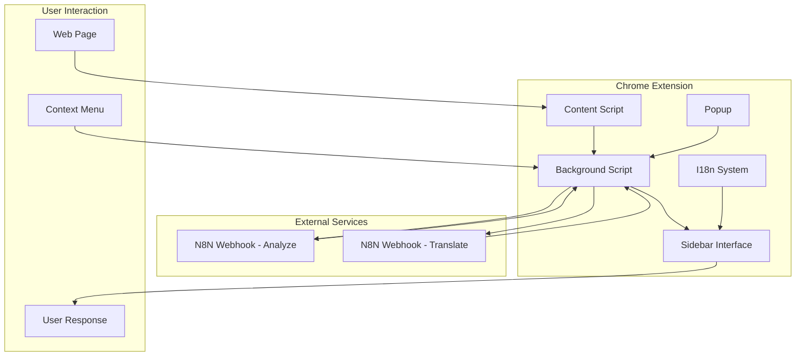
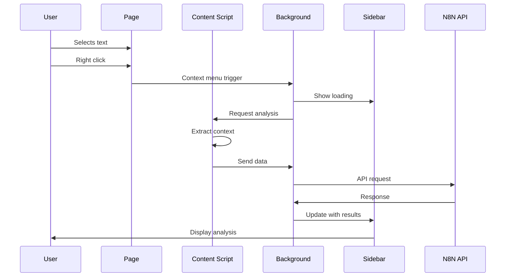
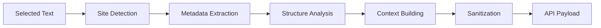
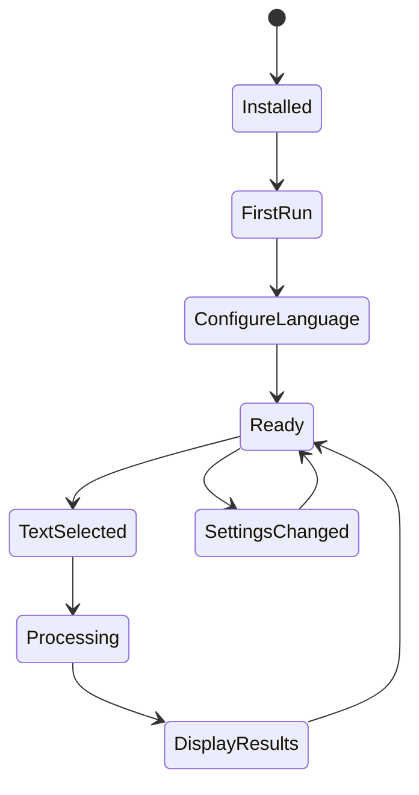

# Bavel - Visão Geral da Arquitetura

## 🏗️ Arquitetura High-Level



## 📁 Estrutura de Componentes

### Core Components

#### 1. **Manifest (manifest.json)**
```json
{
  "manifest_version": 3,
  "permissions": [
    "contextMenus", "activeTab", "storage", "sidePanel"
  ],
  "host_permissions": ["<all_urls>"],
  "background": {"service_worker": "src/background/background.js"},
  "content_scripts": [{"matches": ["<all_urls>"]}],
  "side_panel": {"default_path": "src/sidebar/sidebar.html"}
}
```

#### 2. **Background Script Architecture**
```javascript
// Service Worker Pattern
class BavelBackground {
  constructor() {
    this.setupContextMenu();
    this.setupMessageListeners();
  }
  
  // API Communication Layer
  async handleAPIRequest(data) {
    // N8N Integration
    // Fallback Logic
    // Error Handling
  }
  
  // Message Router
  routeMessage(message, sender, sendResponse) {
    // Content ↔ Background ↔ Sidebar
  }
}
```

#### 3. **Content Script Architecture**
```javascript
// Page Integration Layer
class BavelContent {
  constructor() {
    this.setupSelectionListeners();
    this.setupMessageHandlers();
  }
  
  // Context Extraction Engine
  extractPageContext(selectedText) {
    return {
      siteDetection: this.detectSiteType(),
      contentAnalysis: this.analyzeContent(),
      metadataExtraction: this.extractMetadata(),
      structuralAnalysis: this.analyzeStructure()
    };
  }
}
```

#### 4. **Sidebar Interface Architecture**
```javascript
// UI State Management
class BavelSidebar {
  constructor() {
    this.screens = ['welcome', 'idle', 'loading', 'analysis'];
    this.currentScreen = null;
    this.setupEventHandlers();
  }
  
  // Screen Management
  showScreen(screenName, data) {
    this.hideAllScreens();
    this.renderScreen(screenName, data);
    this.updateI18n();
  }
}
```

## 🔄 Data Flow Architecture

### Message Passing System



### State Management

#### Chrome Storage Schema
```javascript
{
  // User Configuration
  userLanguage: "pt" | "en" | "es" | "fr" | "de" | "it",
  isFirstTime: boolean,
  
  // Future Expansions
  preferences: {
    responseStyle: "formal" | "casual" | "technical",
    responseLength: "short" | "medium" | "long",
    defaultTone: "helpful" | "critical" | "neutral"
  }
}
```

## 🌐 API Integration Layer

### N8N Webhook Integration

#### Request Pipeline
```javascript
class APIClient {
  constructor() {
    this.endpoints = {
      analyze: 'https://n8n.ai-shield.online/webhook/bavel/analyze',
      translate: 'https://n8n.ai-shield.online/webhook/bavel/translate'
    };
  }
  
  async makeRequest(endpoint, payload) {
    // 1. Validate payload
    // 2. Add headers
    // 3. Send request
    // 4. Handle N8N array response
    // 5. Process and return
  }
}
```

#### Response Processing
```javascript
// N8N returns arrays, we extract first item
const processN8NResponse = (rawResponse) => {
  const result = Array.isArray(rawResponse) ? rawResponse[0] : rawResponse;
  
  if (!result.success) {
    throw new Error(result.error);
  }
  
  return result.data;
};
```

## 🧠 Context Extraction Engine

### Site Detection Algorithm
```javascript
const siteDetectors = {
  'stackoverflow': {
    hostname: ['stackoverflow.com'],
    patterns: ['/questions/', '.question'],
    extractors: ['question-body', 'answer']
  },
  'reddit': {
    hostname: ['reddit.com'],
    patterns: ['/r/', '.post'],
    extractors: ['.usertext-body', '.md']
  },
  'github': {
    hostname: ['github.com'],
    patterns: ['/issues/', '/pull/'],
    extractors: ['.issue-content', '.comment-body']
  }
};
```

### Content Analysis Pipeline


## 🎨 UI Component Architecture

### Screen State Machine
```javascript
const screenStates = {
  'welcome': {
    condition: () => !hasUserLanguage() || isFirstTime(),
    components: ['LanguageSelector', 'SaveButton'],
    transitions: ['idle']
  },
  'idle': {
    condition: () => hasUserLanguage() && !isProcessing(),
    components: ['Instructions', 'SettingsButton'],
    transitions: ['loading', 'welcome']
  },
  'loading': {
    condition: () => isProcessing(),
    components: ['Spinner', 'ProgressSteps', 'TextPreview'],
    transitions: ['analysis', 'idle']
  },
  'analysis': {
    condition: () => hasResults(),
    components: ['TextDisplay', 'Translation', 'Context', 'Suggestions', 'ResponseArea'],
    transitions: ['loading', 'idle']
  }
};
```

### Component Hierarchy
```
Sidebar
├── Header
│   ├── Logo
│   └── SettingsButton
├── WelcomeScreen
│   ├── LanguageSelector
│   └── SaveButton
├── IdleScreen
│   ├── Instructions
│   └── ChangeLanguageButton
├── LoadingScreen
│   ├── Spinner
│   ├── ProgressSteps
│   └── TextPreview
└── AnalysisScreen
    ├── OriginalText
    ├── Translation
    ├── Context
    ├── Suggestions
    └── ResponseArea
        ├── TextArea
        ├── ActionButtons
        └── TranslationResult
```

## 🌍 Internationalization Architecture

### I18n System Design
```javascript
class I18n {
  constructor() {
    this.currentLanguage = 'pt';
    this.translations = {
      pt: { /* Portuguese translations */ },
      en: { /* English translations */ },
      es: { /* Spanish translations */ },
      fr: { /* French translations */ },
      de: { /* German translations */ },
      it: { /* Italian translations */ }
    };
  }
  
  t(key) {
    // Nested key resolution: "context.summary" -> translations[lang].context.summary
    const keys = key.split('.');
    let value = this.translations[this.currentLanguage];
    
    for (const k of keys) {
      value = value?.[k];
    }
    
    return value || key;
  }
}
```

### Dynamic UI Updates
```javascript
const updateUI = () => {
  // Text content updates
  document.querySelectorAll('[data-i18n]').forEach(element => {
    element.textContent = i18n.t(element.getAttribute('data-i18n'));
  });
  
  // Placeholder updates
  document.querySelectorAll('[data-i18n-placeholder]').forEach(element => {
    element.placeholder = i18n.t(element.getAttribute('data-i18n-placeholder'));
  });
  
  // Title updates
  document.querySelectorAll('[data-i18n-title]').forEach(element => {
    element.title = i18n.t(element.getAttribute('data-i18n-title'));
  });
};
```

## 🔒 Security Architecture

### Content Sanitization
```javascript
const sanitizeContent = (html) => {
  const div = document.createElement('div');
  div.innerHTML = html;
  
  // Remove dangerous elements
  div.querySelectorAll('script, style, noscript').forEach(el => el.remove());
  
  // Remove event attributes
  div.querySelectorAll('*').forEach(el => {
    Array.from(el.attributes).forEach(attr => {
      if (attr.name.startsWith('on')) {
        el.removeAttribute(attr.name);
      }
    });
  });
  
  return div.textContent;
};
```

### Permission Model
- **Minimal permissions:** Only what's necessary
- **activeTab:** Access current tab only when triggered
- **No persistent access:** Content scripts don't persist
- **Sandboxed execution:** Service worker isolation

## ⚡ Performance Architecture

### Optimization Strategies

#### 1. **Lazy Loading**
```javascript
// Components loaded on demand
const loadComponent = async (componentName) => {
  if (!componentCache[componentName]) {
    componentCache[componentName] = await import(`./components/${componentName}.js`);
  }
  return componentCache[componentName];
};
```

#### 2. **Request Debouncing**
```javascript
const debouncedAPICall = debounce(async (data) => {
  return await makeAPIRequest(data);
}, 300);
```

#### 3. **Content Size Limits**
```javascript
const limitContent = (content, maxSize = 5000) => {
  return content.length > maxSize 
    ? content.substring(0, maxSize) + '...'
    : content;
};
```

## 🧪 Error Handling Architecture

### Error Boundary System
```javascript
class ErrorHandler {
  static handle(error, context) {
    console.error(`Error in ${context}:`, error);
    
    // User-friendly fallback
    switch (context) {
      case 'api':
        return this.handleAPIError(error);
      case 'extraction':
        return this.handleExtractionError(error);
      case 'ui':
        return this.handleUIError(error);
    }
  }
  
  static handleAPIError(error) {
    // Fallback to offline mode
    return {
      translation: 'Tradução indisponível',
      context: 'Contexto indisponível',
      suggestions: ['Interessante!', 'Concordo.', 'Discordo.']
    };
  }
}
```

## 🔄 Lifecycle Management

### Extension Lifecycle


### Memory Management
- **Event listeners:** Properly removed on cleanup
- **Intervals:** Cleared when switching screens
- **API requests:** Cancelled on navigation
- **Storage:** Minimal footprint with cleanup

## 📊 Monitoring and Observability

### Logging Strategy
```javascript
const logger = {
  levels: ['error', 'warn', 'info', 'debug'],
  
  log(level, context, message, data) {
    if (this.shouldLog(level)) {
      console[level](`[Bavel:${context}] ${message}`, data || '');
    }
  }
};
```

### Performance Metrics
- **API response time:** Tracked per request
- **UI render time:** Measured screen transitions
- **Memory usage:** Monitored in development
- **Error rates:** Logged and analyzed

---

## 🎯 Architectural Decisions

### Why Chrome Extension Manifest V3?
- **Future-proof:** Google's current standard
- **Security:** Service worker model
- **Performance:** Better resource management

### Why N8N Integration?
- **Flexibility:** Easy workflow modifications
- **Scalability:** Can handle multiple LLM providers
- **Cost-effective:** Pay-per-use model

### Why Vanilla JavaScript?
- **Performance:** No framework overhead
- **Simplicity:** Easier debugging and maintenance
- **Compatibility:** Works across all Chrome versions

### Why Side Panel API?
- **Native integration:** Better UX than popup
- **Persistent:** Stays open during navigation
- **Responsive:** Adapts to different screen sizes

---

*Arquitetura documentada para Bavel v1.0.0*