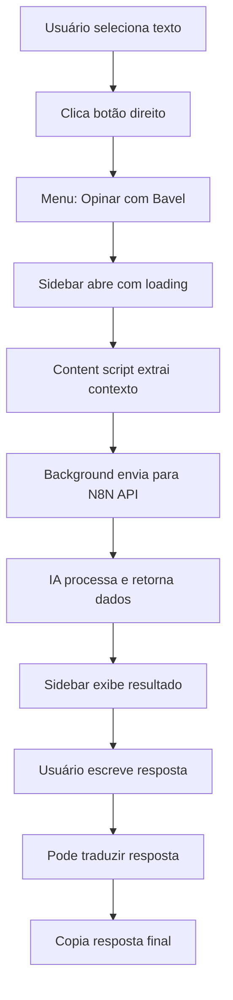
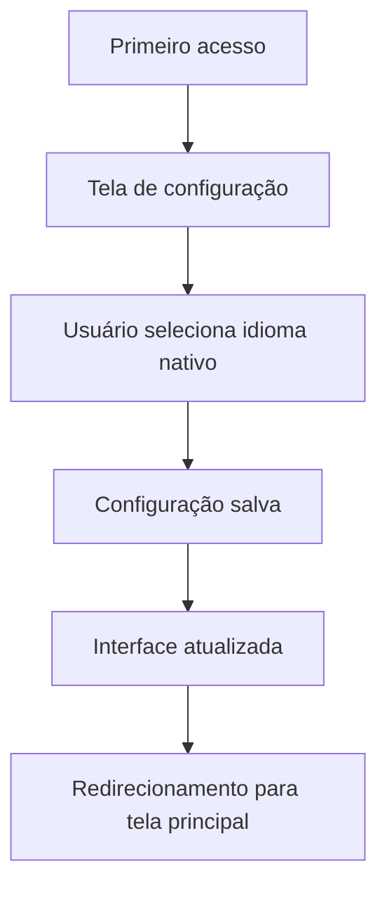
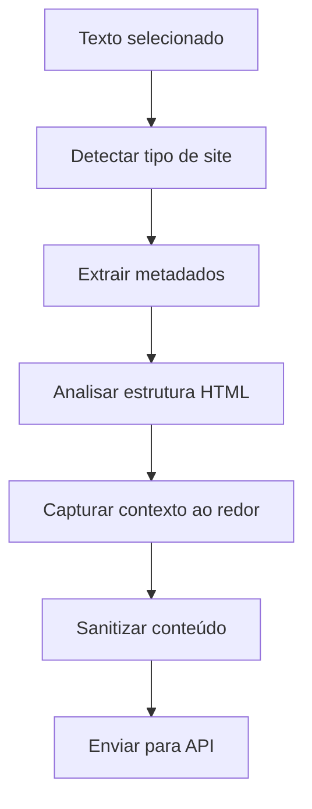

# Bavel - Especificação Técnica Completa

## 📋 Visão Geral

**Bavel** é uma extensão do Chrome desenvolvida para ajudar usuários a praticar idiomas através de respostas contextuais em sites como Reddit, StackOverflow e blogs. A extensão permite que o usuário selecione texto em qualquer página, receba tradução e contexto em seu idioma nativo, e gere respostas apropriadas no idioma original.

### 🎯 Objetivo Principal
Facilitar a prática de idiomas forçando o usuário a escrever em línguas diferentes, mas com suporte contextual inteligente baseado em IA.

### 🔧 Versão Atual
- **Versão:** 1.0.0
- **Manifest:** V3
- **Data de Desenvolvimento:** Agosto 2025
- **Status:** Funcional com integração N8N

## 🏗️ Arquitetura Técnica

### Estrutura de Arquivos
```
bavel/
├── manifest.json              # Configuração da extensão
├── src/
│   ├── background/
│   │   └── background.js      # Service worker principal
│   ├── content/
│   │   └── content.js         # Script injetado nas páginas
│   ├── sidebar/
│   │   ├── sidebar.html       # Interface principal
│   │   ├── sidebar.css        # Estilos da interface
│   │   └── sidebar.js         # Lógica da interface
│   ├── popup/
│   │   └── popup.html         # Popup da extensão
│   └── i18n/
│       └── translations.js    # Sistema de traduções
├── assets/
│   └── css/
│       └── content.css        # Estilos do content script
└── docs/                      # Documentação completa
```

### Componentes Principais

#### 1. **Background Script** (`background.js`)
- **Função:** Service worker que gerencia comunicação e APIs
- **Responsabilidades:**
  - Criação e atualização do menu de contexto
  - Comunicação com APIs externas (N8N)
  - Roteamento de mensagens entre componentes
  - Gerenciamento de estado da extensão

#### 2. **Content Script** (`content.js`)
- **Função:** Script injetado em todas as páginas web
- **Responsabilidades:**
  - Detecção de seleção de texto
  - Extração de contexto rico da página
  - Comunicação com background script
  - Análise da estrutura da página

#### 3. **Sidebar** (`sidebar.html/css/js`)
- **Função:** Interface principal da extensão
- **Responsabilidades:**
  - Exibição de traduções e contexto
  - Gerenciamento de configurações
  - Interface para respostas do usuário
  - Sistema de loading animado

#### 4. **Sistema I18n** (`translations.js`)
- **Função:** Internacionalização completa
- **Idiomas Suportados:** 6 idiomas (PT, EN, ES, FR, DE, IT)
- **Responsabilidades:**
  - Tradução dinâmica da interface
  - Suporte a múltiplos idiomas nativos
  - Configuração persistente de idiomas

## 🔄 Fluxos de Funcionamento

### Fluxo Principal de Uso



### Fluxo de Configuração Inicial



### Fluxo de Extração de Contexto



## 🌐 Integração com APIs

### Endpoints N8N Configurados

#### 1. **Endpoint de Análise**
- **URL:** `https://n8n.ai-shield.online/webhook/bavel/analyze`
- **Método:** POST
- **Função:** Análise completa de texto com IA

**Payload de Entrada:**
```json
{
  "action": "analyze",
  "selectedText": "texto selecionado",
  "userLanguage": "pt",
  "pageContext": {
    "url": "https://example.com",
    "title": "Page Title",
    "siteType": "stackoverflow",
    "mainContent": "contexto da página...",
    "surroundingHTML": {...},
    "headings": [...],
    "metadata": {...}
  },
  "preferences": {
    "responseStyle": "helpful",
    "responseLength": "medium",
    "includeExamples": true,
    "tone": "constructive"
  }
}
```

**Resposta Esperada:**
```json
[{
  "success": true,
  "data": {
    "detectedLanguage": "en",
    "confidence": 0.95,
    "translation": {
      "text": "tradução completa",
      "originalLanguage": "en",
      "targetLanguage": "pt"
    },
    "context": {
      "summary": "contexto explicativo",
      "category": "technical-question",
      "difficulty": "intermediate",
      "topic": "programming",
      "sentiment": "neutral-seeking-help"
    },
    "suggestions": [
      {
        "text": "resposta sugerida",
        "type": "supportive",
        "tone": "helpful",
        "confidence": 0.9
      }
    ],
    "relatedTopics": ["topic1", "topic2"],
    "examples": [...]
  }
}]
```

#### 2. **Endpoint de Tradução**
- **URL:** `https://n8n.ai-shield.online/webhook/bavel/translate`
- **Método:** POST
- **Função:** Tradução de respostas do usuário

**Payload de Entrada:**
```json
{
  "action": "translate",
  "text": "User's response to be translated",
  "sourceLanguage": "en",
  "targetLanguage": "pt",
  "context": "casual conversation"
}
```

**Resposta Esperada:**
```json
[{
  "success": true,
  "data": {
    "translation": "tradução principal",
    "detectedLanguage": "en",
    "confidence": 0.95,
    "alternatives": [
      "tradução alternativa 1",
      "tradução alternativa 2"
    ]
  }
}]
```

## 🎨 Interface e UX

### Telas Implementadas

#### 1. **Tela de Configuração**
- **Função:** Configuração inicial do idioma nativo
- **Elementos:**
  - Seletor de idioma (6 opções)
  - Botão de confirmação
  - Texto explicativo multilíngue

#### 2. **Tela Principal (Idle)**
- **Função:** Estado de espera com instruções
- **Elementos:**
  - Ícone ilustrativo
  - Instruções passo-a-passo
  - Botão de alteração de idioma

#### 3. **Tela de Loading**
- **Função:** Feedback visual durante processamento
- **Elementos:**
  - Spinner animado
  - Barra de progresso
  - 3 etapas animadas:
    - 🔍 Extraindo contexto
    - 🌐 Traduzindo
    - 💡 Gerando sugestões
  - Preview do texto selecionado

#### 4. **Tela de Análise**
- **Função:** Resultado completo da análise
- **Seções:**
  - **Texto Original:** Com idioma detectado e contagem
  - **Tradução:** Para idioma nativo do usuário
  - **Contexto:** Explicação da situação
  - **Sugestões:** Respostas clicáveis
  - **Área de Resposta:** Campo para usuário escrever
  - **Tradução de Resposta:** Com alternativas clicáveis

### Sistema de Temas e Cores
- **Cor Principal:** #2563eb (Azul)
- **Cor Secundária:** #f8f9fa (Cinza claro)
- **Sucesso:** #10b981 (Verde)
- **Erro:** #ef4444 (Vermelho)
- **Design:** Moderno, clean, responsivo

## 🔍 Detecção e Contextualização

### Sites Suportados (Auto-detecção)

| Site | Identificador | Características |
|------|---------------|-----------------|
| StackOverflow | `stackoverflow` | Perguntas técnicas, código |
| Reddit | `reddit` | Discussões, comentários |
| GitHub | `github` | Código, issues, PRs |
| Medium/Dev.to | `blog` | Artigos, posts |
| Hacker News | `forum` | Discussões técnicas |
| Sites genéricos | `generic` | Outros tipos de conteúdo |

### Contexto Extraído

#### Metadados da Página
- **URL e título**
- **Descrição e keywords**
- **Autor e data de publicação**
- **Idioma da página**

#### Estrutura do Conteúdo
- **Conteúdo principal** (até 1000 chars)
- **Headings** (H1-H6)
- **Contexto ao redor** do texto selecionado
- **Elementos anteriores/posteriores**

#### Análise Semântica
- **Tipo de conteúdo** (pergunta, discussão, artigo)
- **Nível de dificuldade**
- **Sentimento do texto**
- **Tópicos relacionados**

## 💾 Persistência e Configurações

### Chrome Storage (Sync)
```javascript
{
  userLanguage: "pt",        // Idioma nativo
  isFirstTime: false,        // Flag de primeiro acesso
  preferences: {             // Configurações futuras
    responseStyle: "helpful",
    defaultTone: "constructive"
  }
}
```

### Configurações Suportadas
- **Idioma nativo:** 6 idiomas disponíveis
- **Persistência:** Sincronizada entre dispositivos
- **Reset:** Possível via botão de configurações

## 🛡️ Segurança e Privacidade

### Permissões Necessárias
- **contextMenus:** Para menu de clique direito
- **activeTab:** Acesso à aba ativa apenas
- **storage:** Armazenamento de configurações
- **sidePanel:** Interface lateral nativa
- **host_permissions:** Acesso a todos os sites (`<all_urls>`)

### Tratamento de Dados
- **Texto selecionado:** Enviado para API apenas durante uso
- **Contexto da página:** Sanitizado antes do envio
- **Dados pessoais:** Não coletados ou armazenados
- **Scripts maliciosos:** Removidos durante sanitização

### Fallback Offline
- **Detecção de idioma:** Algoritmo local
- **Traduções básicas:** Dicionário local limitado
- **Sugestões genéricas:** Lista pré-definida
- **Funcionamento:** Garantido mesmo sem internet

## 🚀 Performance e Otimizações

### Otimizações Implementadas
- **Lazy loading:** Componentes carregados sob demanda
- **Debounce:** Evita chamadas excessivas à API
- **Cache local:** Resultados temporariamente armazenados
- **Sanitização:** Conteúdo limitado e filtrado
- **Timeouts:** Requests com limite de tempo

### Métricas de Performance
- **Tempo de carregamento:** < 1s para interface
- **Tamanho do contexto:** Limitado a 5KB
- **Memory usage:** Mínimo necessário
- **CPU impact:** Negligível

## 🧪 Testing e Debugging

### Logs Implementados
```javascript
// Content Script
console.log('Sending to background:', data);
console.log('Page context extracted:', context);

// Background Script  
console.log('Calling N8N API:', endpoint, payload);
console.log('N8N API Response:', result);
console.log('API Error, falling back:', error);

// Sidebar
console.log('Sidebar received message:', message);
```

### Pontos de Debug
1. **Extração de contexto:** Console da página
2. **Comunicação API:** Console do background
3. **Interface:** Console da sidebar
4. **Erros:** Capturados e logados em todos os componentes

## 📈 Possíveis Melhorias Futuras

### Funcionalidades Planejadas
- **Histórico de traduções** locais
- **Configurações avançadas** de resposta
- **Suporte a mais idiomas**
- **Integração com outros LLMs**
- **Métricas de uso** e aprendizado
- **Modo offline** expandido
- **Shortcuts de teclado**
- **Dark mode**

### Integrações Futuras
- **Google Translate API** como backup
- **OpenAI Direct API** 
- **Claude API** nativa
- **Serviços de tradução** locais
- **Analytics** de uso

## 🎯 Status do Projeto

### ✅ Implementado e Funcional
- [x] Arquitetura completa da extensão
- [x] Sistema de internacionalização (6 idiomas)
- [x] Integração com N8N (2 endpoints)
- [x] Extração de contexto rico
- [x] Interface completa e responsiva
- [x] Sistema de loading animado
- [x] Menu de contexto multilíngue
- [x] Tradução com alternativas
- [x] Fallback offline
- [x] Tratamento de erros robusto

### 🔄 Em Desenvolvimento
- [ ] Testes automatizados
- [ ] Documentação de usuário
- [ ] Otimizações de performance
- [ ] Publicação na Chrome Web Store

### 📋 Backlog
- [ ] Métricas e analytics
- [ ] Configurações avançadas
- [ ] Histórico de uso
- [ ] Modo escuro
- [ ] Integração com mais LLMs

---

## 📞 Informações Técnicas

**Desenvolvido por:** Claude Code Assistant  
**Tecnologias:** Manifest V3, Vanilla JS, CSS3, N8N, IA  
**Compatibilidade:** Chrome 88+  
**Licença:** A definir  
**Repositório:** Local development  

---

*Documento atualizado em: Agosto 2025*  
*Versão da especificação: 1.0*