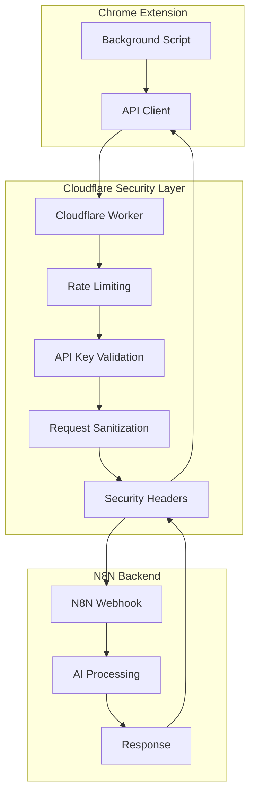

# 🔐 Arquitetura de Segurança - Bavel Extension

## 🏗️ Visão Geral da Arquitetura Segura



## 🔑 Sistema de Autenticação

### 1. API Key Management
```javascript
// Cloudflare Worker - API Key Validation
const VALID_API_KEYS = new Map([
  ['bavel_prod_key_2024', { name: 'Bavel Extension', rateLimit: 100 }],
  ['bavel_dev_key_2024', { name: 'Bavel Dev', rateLimit: 50 }]
]);

async function validateApiKey(request) {
  const apiKey = request.headers.get('X-Bavel-API-Key');
  
  if (!apiKey || !VALID_API_KEYS.has(apiKey)) {
    return new Response(JSON.stringify({
      success: false,
      error: 'Invalid or missing API key'
    }), {
      status: 401,
      headers: { 'Content-Type': 'application/json' }
    });
  }
  
  return VALID_API_KEYS.get(apiKey);
}
```

### 2. Request Signature (HMAC)
```javascript
// Cloudflare Worker - Request Signature Validation
async function validateSignature(request, body) {
  const signature = request.headers.get('X-Bavel-Signature');
  const timestamp = request.headers.get('X-Bavel-Timestamp');
  
  if (!signature || !timestamp) {
    return false;
  }
  
  // Verificar timestamp (máximo 5 minutos)
  const now = Math.floor(Date.now() / 1000);
  if (Math.abs(now - parseInt(timestamp)) > 300) {
    return false;
  }
  
  // Verificar assinatura HMAC
  const secret = await BAVEL_HMAC_SECRET.get('default');
  const payload = timestamp + JSON.stringify(body);
  
  const encoder = new TextEncoder();
  const key = await crypto.subtle.importKey(
    'raw',
    encoder.encode(secret),
    { name: 'HMAC', hash: 'SHA-256' },
    false,
    ['sign']
  );
  
  const expectedSignature = await crypto.subtle.sign(
    'HMAC',
    key,
    encoder.encode(payload)
  );
  
  const expectedHex = Array.from(new Uint8Array(expectedSignature))
    .map(b => b.toString(16).padStart(2, '0'))
    .join('');
  
  return signature === expectedHex;
}
```

## 🚦 Rate Limiting & Throttling

### 1. Rate Limiting por IP e API Key
```javascript
// Cloudflare Worker - Rate Limiting
class RateLimiter {
  constructor() {
    this.limits = {
      ip: { requests: 50, window: 900 }, // 50 req/15min por IP
      apiKey: { requests: 100, window: 900 }, // 100 req/15min por API Key
      global: { requests: 1000, window: 900 } // 1000 req/15min global
    };
  }
  
  async checkRateLimit(type, identifier) {
    const key = `rate_limit:${type}:${identifier}`;
    const current = await RATE_LIMIT_KV.get(key);
    const now = Math.floor(Date.now() / 1000);
    const window = this.limits[type].window;
    const limit = this.limits[type].requests;
    
    if (!current) {
      await RATE_LIMIT_KV.put(key, JSON.stringify({
        count: 1,
        resetTime: now + window
      }), { expirationTtl: window });
      return { allowed: true, remaining: limit - 1 };
    }
    
    const data = JSON.parse(current);
    
    if (now > data.resetTime) {
      await RATE_LIMIT_KV.put(key, JSON.stringify({
        count: 1,
        resetTime: now + window
      }), { expirationTtl: window });
      return { allowed: true, remaining: limit - 1 };
    }
    
    if (data.count >= limit) {
      return { 
        allowed: false, 
        remaining: 0, 
        resetTime: data.resetTime 
      };
    }
    
    data.count++;
    await RATE_LIMIT_KV.put(key, JSON.stringify(data), { 
      expirationTtl: data.resetTime - now 
    });
    
    return { allowed: true, remaining: limit - data.count };
  }
}
```

### 2. Adaptive Rate Limiting
```javascript
// Rate limiting inteligente baseado em comportamento
async function getAdaptiveRateLimit(clientInfo) {
  const baseLimit = 100;
  let multiplier = 1;
  
  // Histórico de comportamento
  const history = await getBehaviorHistory(clientInfo.apiKey);
  
  // Aumentar limite para clientes confiáveis
  if (history.trustScore > 0.8) {
    multiplier = 1.5;
  } else if (history.suspiciousActivity > 0.3) {
    multiplier = 0.5; // Reduzir para clientes suspeitos
  }
  
  return Math.floor(baseLimit * multiplier);
}
```

## 🛡️ Proteção contra Ataques

### 1. Input Sanitization
```javascript
// Cloudflare Worker - Sanitização de entrada
function sanitizeInput(data) {
  const sanitized = { ...data };
  
  // Limitar tamanho dos campos
  const limits = {
    selectedText: 5000,
    userLanguage: 10,
    'pageContext.title': 200,
    'pageContext.url': 2048,
    'pageContext.mainContent': 10000
  };
  
  function truncateField(obj, path, limit) {
    const keys = path.split('.');
    let current = obj;
    
    for (let i = 0; i < keys.length - 1; i++) {
      if (!current[keys[i]]) return;
      current = current[keys[i]];
    }
    
    const finalKey = keys[keys.length - 1];
    if (current[finalKey] && typeof current[finalKey] === 'string') {
      current[finalKey] = current[finalKey].substring(0, limit);
    }
  }
  
  Object.entries(limits).forEach(([path, limit]) => {
    truncateField(sanitized, path, limit);
  });
  
  // Validar estrutura obrigatória
  if (!sanitized.selectedText || !sanitized.userLanguage) {
    throw new Error('Missing required fields');
  }
  
  // Sanitizar HTML/Scripts
  const dangerousPatterns = [
    /<script\b[^<]*(?:(?!<\/script>)<[^<]*)*<\/script>/gi,
    /<iframe\b[^<]*(?:(?!<\/iframe>)<[^<]*)*<\/iframe>/gi,
    /javascript:/gi,
    /on\w+\s*=/gi
  ];
  
  function sanitizeString(str) {
    if (typeof str !== 'string') return str;
    return dangerousPatterns.reduce((clean, pattern) => 
      clean.replace(pattern, ''), str
    );
  }
  
  function deepSanitize(obj) {
    if (typeof obj === 'string') return sanitizeString(obj);
    if (Array.isArray(obj)) return obj.map(deepSanitize);
    if (obj && typeof obj === 'object') {
      return Object.fromEntries(
        Object.entries(obj).map(([k, v]) => [k, deepSanitize(v)])
      );
    }
    return obj;
  }
  
  return deepSanitize(sanitized);
}
```

### 2. DDoS Protection
```javascript
// Proteção avançada contra DDoS
async function detectDDoSPattern(clientIP) {
  const key = `ddos_pattern:${clientIP}`;
  const windowSize = 60; // 1 minuto
  const now = Math.floor(Date.now() / 1000);
  
  const pattern = await SECURITY_KV.get(key);
  const requests = pattern ? JSON.parse(pattern) : [];
  
  // Filtrar requests do último minuto
  const recentRequests = requests.filter(t => now - t < windowSize);
  recentRequests.push(now);
  
  // Detectar padrões suspeitos
  const requestsPerSecond = recentRequests.length / windowSize;
  const burstRequests = recentRequests.filter(t => now - t < 5).length;
  
  await SECURITY_KV.put(key, JSON.stringify(recentRequests), {
    expirationTtl: windowSize * 2
  });
  
  return {
    isDDoS: requestsPerSecond > 2 || burstRequests > 10,
    rps: requestsPerSecond,
    burstSize: burstRequests
  };
}
```

## 🔒 Headers de Segurança

### 1. Security Headers Configuration
```javascript
// Cloudflare Worker - Headers de segurança
function addSecurityHeaders(response) {
  const securityHeaders = {
    'Strict-Transport-Security': 'max-age=31536000; includeSubDomains',
    'X-Content-Type-Options': 'nosniff',
    'X-Frame-Options': 'DENY',
    'X-XSS-Protection': '1; mode=block',
    'Referrer-Policy': 'strict-origin-when-cross-origin',
    'Content-Security-Policy': "default-src 'none'; script-src 'none';",
    'Permissions-Policy': 'geolocation=(), microphone=(), camera=()',
    'Cache-Control': 'no-store, no-cache, must-revalidate',
    'Pragma': 'no-cache'
  };
  
  Object.entries(securityHeaders).forEach(([key, value]) => {
    response.headers.set(key, value);
  });
  
  return response;
}
```

### 2. CORS Configuration
```javascript
// CORS restritivo para extensão
function setCORSHeaders(response, origin) {
  const allowedOrigins = [
    'chrome-extension://*',
    'moz-extension://*'
  ];
  
  const isValidOrigin = allowedOrigins.some(allowed => {
    if (allowed.includes('*')) {
      const pattern = allowed.replace('*', '.*');
      return new RegExp(pattern).test(origin || '');
    }
    return allowed === origin;
  });
  
  if (isValidOrigin) {
    response.headers.set('Access-Control-Allow-Origin', origin);
    response.headers.set('Access-Control-Allow-Methods', 'POST, OPTIONS');
    response.headers.set('Access-Control-Allow-Headers', 
      'Content-Type, X-Bavel-API-Key, X-Bavel-Signature, X-Bavel-Timestamp'
    );
    response.headers.set('Access-Control-Max-Age', '86400');
  }
  
  return response;
}
```

## 📊 Monitoramento e Logging

### 1. Security Logging
```javascript
// Cloudflare Worker - Security Logging
async function logSecurityEvent(event) {
  const logEntry = {
    timestamp: new Date().toISOString(),
    type: event.type,
    severity: event.severity,
    clientIP: event.clientIP,
    userAgent: event.userAgent,
    apiKey: event.apiKey ? event.apiKey.substring(0, 8) + '***' : null,
    details: event.details,
    blocked: event.blocked || false
  };
  
  // Log para Cloudflare Analytics
  console.log('SECURITY_EVENT:', JSON.stringify(logEntry));
  
  // Alertas para eventos críticos
  if (event.severity === 'HIGH') {
    await sendSecurityAlert(logEntry);
  }
}

async function sendSecurityAlert(logEntry) {
  // Webhook para alertas de segurança
  await fetch(SECURITY_WEBHOOK_URL, {
    method: 'POST',
    headers: { 'Content-Type': 'application/json' },
    body: JSON.stringify({
      alert: 'High severity security event',
      details: logEntry
    })
  });
}
```

### 2. Performance Monitoring
```javascript
// Monitoramento de performance
class PerformanceMonitor {
  static async trackRequest(startTime, endTime, success, clientInfo) {
    const duration = endTime - startTime;
    
    const metrics = {
      timestamp: new Date().toISOString(),
      duration,
      success,
      clientIP: clientInfo.ip,
      apiKey: clientInfo.apiKey?.substring(0, 8) + '***'
    };
    
    // Armazenar métricas
    await METRICS_KV.put(
      `metrics:${Date.now()}:${Math.random()}`,
      JSON.stringify(metrics),
      { expirationTtl: 86400 * 7 } // 7 dias
    );
    
    // Alertas para performance
    if (duration > 5000) { // > 5 segundos
      await logSecurityEvent({
        type: 'SLOW_REQUEST',
        severity: 'MEDIUM',
        clientIP: clientInfo.ip,
        details: { duration, success }
      });
    }
  }
}
```

## 🚀 Deploy da Arquitetura

### 1. Cloudflare Worker Principal
```javascript
// worker.js - Cloudflare Worker principal
export default {
  async fetch(request, env, ctx) {
    const startTime = Date.now();
    const clientIP = request.headers.get('CF-Connecting-IP');
    const userAgent = request.headers.get('User-Agent');
    
    try {
      // 1. Verificar método HTTP
      if (request.method === 'OPTIONS') {
        return handleCORS();
      }
      
      if (request.method !== 'POST') {
        return new Response('Method not allowed', { status: 405 });
      }
      
      // 2. Detectar DDoS
      const ddosCheck = await detectDDoSPattern(clientIP);
      if (ddosCheck.isDDoS) {
        await logSecurityEvent({
          type: 'DDOS_DETECTED',
          severity: 'HIGH',
          clientIP,
          userAgent,
          details: ddosCheck,
          blocked: true
        });
        
        return new Response('Too many requests', { status: 429 });
      }
      
      // 3. Validar API Key
      const apiKeyInfo = await validateApiKey(request);
      if (apiKeyInfo instanceof Response) {
        return apiKeyInfo; // Retorna erro de autenticação
      }
      
      // 4. Rate Limiting
      const rateLimiter = new RateLimiter();
      const ipLimit = await rateLimiter.checkRateLimit('ip', clientIP);
      const keyLimit = await rateLimiter.checkRateLimit('apiKey', request.headers.get('X-Bavel-API-Key'));
      
      if (!ipLimit.allowed || !keyLimit.allowed) {
        return new Response(JSON.stringify({
          success: false,
          error: 'Rate limit exceeded'
        }), { 
          status: 429,
          headers: { 'Content-Type': 'application/json' }
        });
      }
      
      // 5. Processar request
      const body = await request.json();
      
      // 6. Validar assinatura HMAC
      if (!await validateSignature(request, body)) {
        await logSecurityEvent({
          type: 'INVALID_SIGNATURE',
          severity: 'HIGH',
          clientIP,
          userAgent,
          blocked: true
        });
        
        return new Response('Invalid signature', { status: 401 });
      }
      
      // 7. Sanitizar entrada
      const sanitizedBody = sanitizeInput(body);
      
      // 8. Encaminhar para N8N
      const n8nResponse = await fetch(N8N_WEBHOOK_URL, {
        method: 'POST',
        headers: {
          'Content-Type': 'application/json',
          'X-Forwarded-For': clientIP,
          'X-Extension-Version': request.headers.get('X-Extension-Version')
        },
        body: JSON.stringify(sanitizedBody)
      });
      
      const result = await n8nResponse.json();
      
      // 9. Criar resposta com headers de segurança
      let response = new Response(JSON.stringify(result), {
        status: n8nResponse.status,
        headers: { 'Content-Type': 'application/json' }
      });
      
      response = addSecurityHeaders(response);
      response = setCORSHeaders(response, request.headers.get('Origin'));
      
      // 10. Log de métricas
      await PerformanceMonitor.trackRequest(
        startTime, 
        Date.now(), 
        n8nResponse.ok,
        { ip: clientIP, apiKey: request.headers.get('X-Bavel-API-Key') }
      );
      
      return response;
      
    } catch (error) {
      await logSecurityEvent({
        type: 'WORKER_ERROR',
        severity: 'HIGH',
        clientIP,
        userAgent,
        details: { error: error.message }
      });
      
      return new Response(JSON.stringify({
        success: false,
        error: 'Internal server error'
      }), { 
        status: 500,
        headers: { 'Content-Type': 'application/json' }
      });
    }
  }
};
```

## 🔧 Configuração do Ambiente

### 1. Variáveis de Ambiente (wrangler.toml)
```toml
name = "bavel-security-proxy"
main = "worker.js"
compatibility_date = "2024-01-01"

[env.production]
vars = { 
  N8N_WEBHOOK_URL = "https://n8n.ai-shield.online/webhook/bavel/analyze",
  SECURITY_WEBHOOK_URL = "https://your-security-alerts.com/webhook"
}

[[env.production.kv_namespaces]]
binding = "RATE_LIMIT_KV"
id = "your-rate-limit-kv-id"

[[env.production.kv_namespaces]]
binding = "SECURITY_KV"
id = "your-security-kv-id"

[[env.production.kv_namespaces]]
binding = "METRICS_KV"
id = "your-metrics-kv-id"

[env.production.secrets]
BAVEL_HMAC_SECRET = "your-hmac-secret-key"
```

### 2. Deploy Commands
```bash
# Deploy do Worker
wrangler deploy --env production

# Configurar secrets
wrangler secret put BAVEL_HMAC_SECRET --env production

# Criar KV namespaces
wrangler kv:namespace create "RATE_LIMIT_KV" --env production
wrangler kv:namespace create "SECURITY_KV" --env production
wrangler kv:namespace create "METRICS_KV" --env production
```

Agora vou implementar as atualizações na extensão para suportar essa nova arquitetura de segurança.